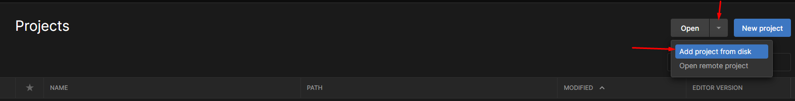

# README

# TestRobot-BB-8

Proyecto mecánicas robot BB-8

Este proyecto está orientado a desarrollar un videojuego teniendo al personaje principal como una esfera en mi caso escogí al robot BB-8 con una serie de mecánicas las cuales consisten en poderse mover con las teclas AWSD y adicionalmente tener un Jetpack con algunas variables disponibles en el inspector para poder ser cambiadas a gusto del cliente.

### DOCUMENTACION DEL PROYECTO

[Notion documentación](https://www.notion.so/Test-ROBOT-BB-8-e598261f3d7f4daab1cd5818dcc2d9da) 

### JUEGO EJECUTABLE

[Gameplay](https://drive.google.com/drive/folders/161yeBvA9Xxi1wgf4x38SEP5u5RlN2ipJ?usp=sharing)

### COPIA PROYECT DRIVE

[Drive](https://drive.google.com/drive/folders/1JEQ5Nn4ABizuzjvxCS44PGJR-kSkCl4B?usp=sharing)

### VIDEO DEMO

[https://www.youtube.com/watch?v=PW_sm3Zo2xY](https://www.youtube.com/watch?v=PW_sm3Zo2xY)

## Requisitos

- Instale UnityHub
- Instale la versión correspondiente de Unity  2021.3.13f

## Como implementar el proyecto en local

Siguiendo estos pasos podrás implementar el proyecto en tu equipo sin ningún problema.

 

- Paso 1: Clone el repositorio

```bash
git clone https://github.com/EdissonRivera/TestRobot-BB-8.git
```

- Paso 2:  Agregar proyecto a Unity Hub




- Paso3: Abra el proyecto


### 

- Paso4: Una ves abierto el proyecto, posicionarse en la scenaMenu


 

Paso 5: Si desea hacer cambios a la velocidad y fuerza de salto, ingresar a la scena GamePlay y seleccionar el player


Paso 6: Editar configuración Jetpack

